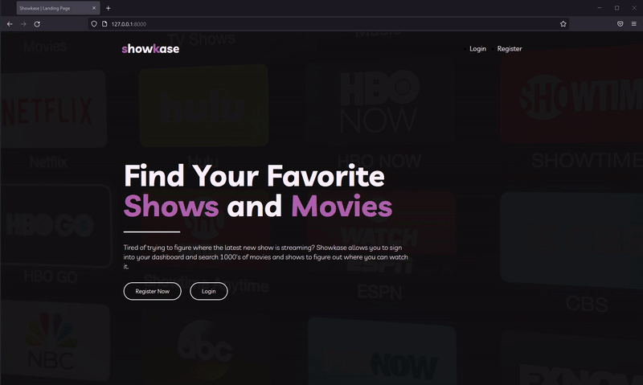
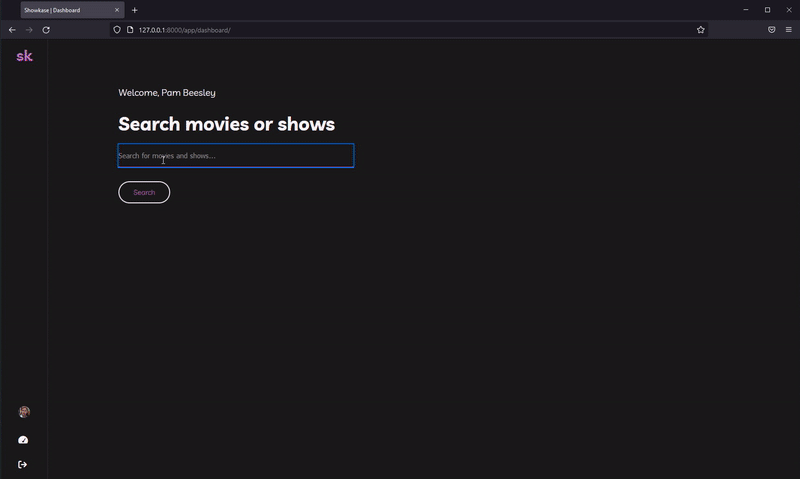
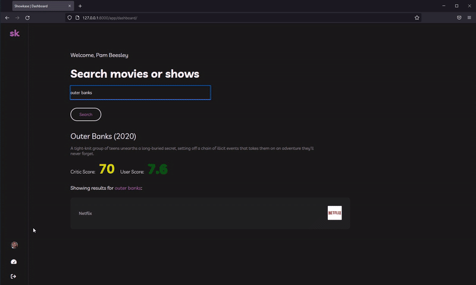

# Getting Started

[Getting Started: Run Locally](./Getting-Started.md "Getting Started")

# Preview

## Logging In, Registering and Updating Profile



## Search functionality



## Mobile View



# Showkase Project

Users will be able to create an account and log in to a user portal that will show that user's profile. Once inside the user portal the user will be able to search for movies and TV shows and what platforms they are available on (Netflix, HBO Max, Crunchyroll, Hulu etc.). User will be able to create lists to and and remove saved shows/movies to their list on their profile page.
​

API: https://api.watchmode.com/

## Biolerplate Django-Webpack Setup

Repo: https://github.com/AccordBox/python-webpack-boilerplate

### Start python server from root path:

```
python manage.py migrate
python manage.py runserver
```

### In another terminal cd into the frontend folder and enter the following commands:

```
npm install
npm run start
```

Webpack will compile javascript and scss using custom template tags in realtime

## Todo

- ~~File structure~~
- ~~Implement webpack in django for scss~~
- ~~Base template configurations~~

- Work on design elements
  - ~~Colors~~, ~~images~~, ~~page flow~~, UI/UX
  - ~~Logo~~
  - ~~Font family~~
  - ~~Font sizes~~
  - ~~CSS vars, globals, css components(ie. buttons, headings, forms)~~
- Pages
  - ~~Nav component~~
  - ~~Home page~~
    - ~~Welcome~~
    - ~~What the app does~~
    - ~~Login~~
    - ~~Register~~
  - Profile
    - ~~Name~~
    - ~~Profile picture~~
    - ~~Search form~~
    - ~~Edit Prrofile info~~
    - **Ability to create/edit and remove lists**
    - ~~(**May need to rework this step**) When search results populate icons pertaining to the show/movie will display~~
    - ~~Platforms to buy or watch on (Amazon, Crunchyroll, HBO Max)~~
    - ~~Output final object for search results with logs, title, src links, etc.~~
    - ~~Small description of movie/show, year released, title~~
    - ~~User rating and critic scores~~

## Future plans

- Adding a favorites List
- '+' or '-' icon for adding to their favorites list
- Clicking on a search result will go to an individual page for that show/movie
- Individual show page
  - Platforms to buy or watch on (Amazon, Crunchyroll, HBO Max)
  - Episodes tab for shows
  - Episode synopsis when specific episode clicked
- Auto fill functionality

## Issues

If the user types a title that has more than 1 show or movie attached to it, the API only returns the most relevant search result using a relevancy algorithm (If a search brings in 2 titles and the higher one is 89.6% relevancy it will only show the higher score title)

- Autofill could fix this so the user can choose before hitting submit or filtering results based on specific parameters may be the better option.
